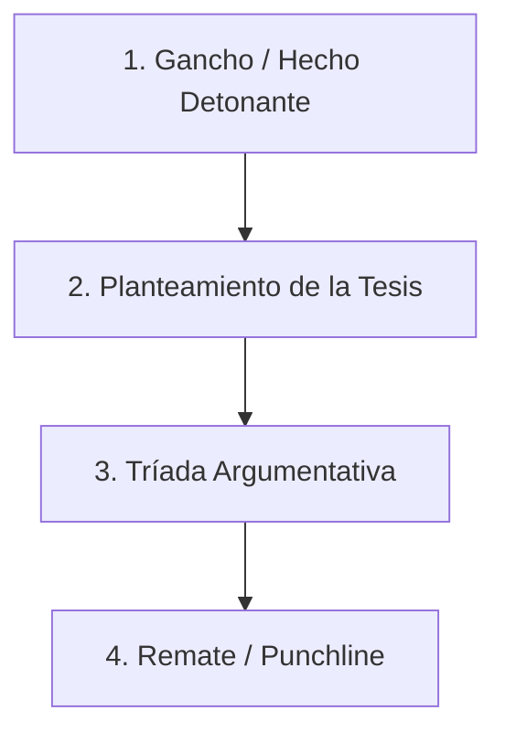

# Redacción y Edición de Columnas de Opinión – Última Prensa

Este skill establece el método y los estándares de redacción para columnas de opinión en **Última Prensa**, combinando la libertad del ensayo periodístico con el rigor fáctico de la investigación y las normas estilísticas de la RAE y las facultades de periodismo.

---

## Principio Rector
> **«Las opiniones son libres, pero los hechos son sagrados»** (C.P. Scott).  
> La columna de opinión no es un espacio para la especulación infundada ni para el rumor. La agudeza del juicio crítico descansa sobre la exactitud de los antecedentes verificables.

---

## Estructura Canónica en 4 Fases

Toda columna debe articularse rigurosamente en torno a una única tesis central a lo largo de 4 etapas:



### 1. El Gancho (Entrada de Opinión)
* **Hecho disparador:** Situar el acontecimiento de actualidad, revelación periodística o debate público reciente que motiva el texto.
* **Captura:** Iniciar con una escena reveladora, una paradoja, un contraste de cifras o una imagen potente. Evitar inicios genéricos («En los últimos tiempos...», «Es sabido que...»).

### 2. Formulación de la Tesis
* Debe quedar explícita en el primer o segundo párrafo.
* No basta con describir un problema («la crisis de la educación superior»); debe formular un **juicio de valor categórico y debatible** («el traspaso encubierto de inmuebles no es solo una falta administrativa, es una estafa al feudo público»).

### 3. Tríada Argumentativa (Cuerpo)
Desarrollar entre 2 y 3 párrafos de argumentación sólida:
1. **Evidencia empírica / Huella documental:** Cifras, fechas, leyes, dictámenes o fallos judiciales que sustentan la postura. Puedes utilizar `ingestar_documentos_md.py` para consultar la documentación oficial del caso.
2. **Análisis de causa-efecto:** Explicar el mecanismo subyacente. ¿Por qué ocurrió esto? ¿Quién se beneficia del statu quo? ¿Cuál es el costo social o institucional?
3. **Contraargumentación (Refutación):** Anticipar la objeción o excusa que esgrimen los aludidos («se argumentará que fue un error de gestión...») y desmontarla con lógica y evidencia («...pero los balances firmados ante notario demuestran deliberación»).

### 4. El Remate (Cierre Contundente)
* Nunca cerrar con un resumen tibio o pasivo del texto.
* **Técnicas recomendadas:**
  * **Estructura circular:** Retomar la imagen, metáfora o frase inicial resignificándola al final.
  * **Proyección / Alerta futura:** Advertir sobre la consecuencia inevitable si no hay corrección institucional.
  * **Interrogante ética:** Formular una pregunta punzante que traslade la responsabilidad al lector o a las autoridades.

---

## Criterios de Estilo y Normas RAE / Fundéu

1. **Extensión:** Entre **600 y 900 palabras** (máximo 1.000 palabras / 3.500 a 5.000 caracteres con espacios).
2. **Puntuación y Ritmo:**
   * Párrafos breves (de 4 a 6 líneas).
   * Uso del punto y seguido para dotar de dinamismo y claridad a las oraciones.
   * Dos puntos (`:`) para introducir explicaciones directas o consecuencias.
3. **Tipografía de Citas:**
   * Citas textuales entre comillas angulares o latinas: «...».
   * Si hay una cita dentro de la cita, usar comillas inglesas: «... "..." ...».
4. **Titulares y Bajadas:**
   * **Titular conceptual:** Evitar titulares puramente informativos; preferir títulos con fuerza reflexiva (ej. *«El negocio de la insolvencia»*, *«El precio del silencio académico»*).
   * **Sin punto final:** Los titulares y bajadas nunca llevan punto final.
5. **Voz y Tono:**
   * Primera persona singular (*«observo»*, *«considero»*) o plural cívico (*«asistimos»*, *«no podemos tolerar»*).
   * Prohibido el uso de condicionales de rumor (*«estaría involucrado»*, *«habrían pagado»*); si hay prueba, se afirma en modo indicativo; si no hay certeza, se describe el estado judicial de la investigación.
   * Evitar lugares comunes (*«a la luz de los hechos»*, *«es menester»*, *«poner el cascabel al gato»*).

---

## Flujo de Publicación Digital

Una vez redactada y aprobada la columna en formato Markdown (`Columnas/YYYY-MM-DD_titulo.md`):

1. **Autoedición:** Pasar la lista de verificación (Checklist) editorial.
2. **Conversión a Substack:**
   ```bash
   python kit-journalism/scripts/exportar_substack.py Columnas/YYYY-MM-DD_titulo.md Columnas/YYYY-MM-DD_titulo.html
   ```
3. El archivo HTML resultante incluye los estilos oficiales (cintillo en color corporativo, bajada destacada, pull quotes y tipografía cuidada) listo para pegar directamente en el editor web.
