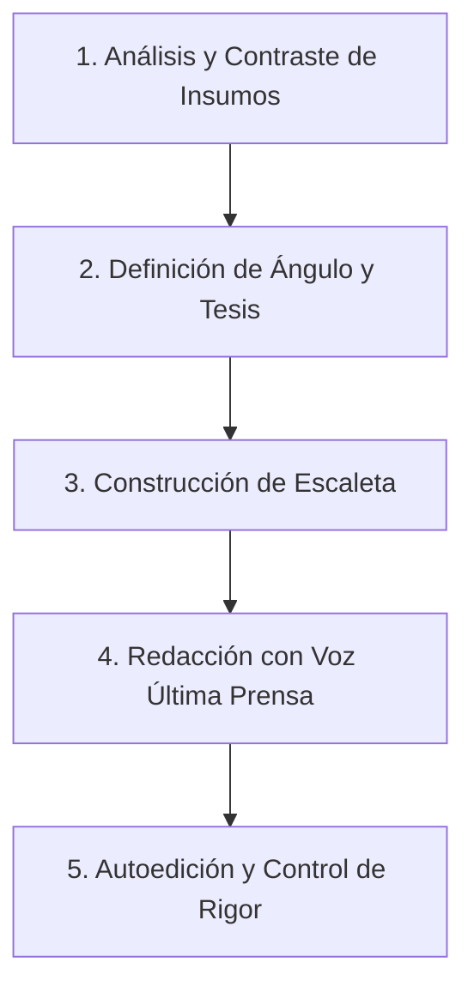

# Redacción de Reportajes – Estilo Última Prensa

Este skill guía la investigación, estructuración, redacción y autoedición de reportajes periodísticos con el tono incisivo, riguroso, humano y analítico característico del periodismo de investigación moderno y digital.

---

## Principios Fundamentales del Estilo Última Prensa

1. **Rigor y Verificación Absoluta:** Ninguna afirmación de peso se sostiene sin sustento (documento oficial, base de datos, testimonio con nombre o fuente confidencial contrastada).
2. **Narrativa sin Ficción:** Prosa envolvente, visual y humana que capta el interés sin caer en la adjetivación vacía o el sensacionalismo. Los hechos y los datos son los protagonistas.
3. **Equilibrio y Derecho a Réplica:** Toda acusación, denuncia o señalamiento institucional debe incluir la contraparte o la constancia explícita de que se solicitó versión y el estado de la respuesta.
4. **Claridad Estructural y Contexto:** Cada cifra se contextualiza (porcentajes, comparativas históricas, costo social/humano).

---

## Flujo de Trabajo para Redactar un Reportaje

Sigue estos 5 pasos estructurados al recibir una solicitud o insumos (notas, documentos, testimonios, tema):

### Paso 1: Análisis y Contraste de Insumos
- Identifica los **hechos comprobables**, los **testimonios de afectados/protagonistas**, las **cifras clave** y los **vacíos de información**.
- Clasifica las fuentes en: *Oficiales*, *Afectados/Ciudadanía*, *Expertos/Analistas independientes* y *Documentación pública o pericial*.

### Paso 2: Definición de Ángulo y Tesis Central
- Formula la tesis periodística en una sola oración contundente: *¿Qué revela este reportaje que antes no se sabía o no se entendía en su dimensión real?*
- Elige el tipo de reportaje adecuado según las [Plantillas de Reportaje](./references/plantillas.md):
  - **Investigación / Denuncia:** Revelación de irregularidades, fiscalización de poder o fondos públicos.
  - **Explicativo / Análisis de Datos:** Desglose de fenómenos complejos (economía, crisis social, tecnología).
  - **Crónica Humana / Testimonial:** El impacto de un suceso a través de historias de vida y comunidad.
  - **Perfil en Profundidad:** Radiografía crítica de un personaje público, líder o institución.

### Paso 3: Construcción de la Escaleta
Antes de redactar, define los bloques estructurales:
- **Titular y Bajada:** De impacto, con verbo de acción y síntesis del hallazgo.
- **Lead / Entrada:** Gancho narrativo (escena, caso testigo o dato demoledor).
- **Tuerca de la Historia (Nut Graf):** Párrafo de contexto que explica por qué esto importa hoy.
- **Bloques Temáticos con Ladillos:** Desarrollo argumental con evidencia, voces y despieces.
- **Cierre:** Proyección, pregunta abierta, contraste final o consecuencia a futuro.

### Paso 4: Redacción con Voz Editorial
- Consulta el [Manual de Estilo Última Prensa](./references/manual_estilo.md) para lineamientos de tono, atribución de citas y reglas sintácticas.
- Utiliza **destacados (*pull quotes*)** y **cajas de datos/claves** para dinamizar la lectura digital.
- Revisa el [Reportaje de Ejemplo](./examples/ejemplo_reportaje.md) como referencia de ritmo y acabado final.

### Paso 5: Autoedición y Control de Calidad
Antes de entregar la pieza al usuario, verifica:
- [ ] ¿El titular promete exactamente lo que el texto demuestra?
- [ ] ¿Se identifican con precisión las fuentes de cada dato crítico?
- [ ] ¿Se evitó el uso de adjetivos calificativos innecesarios (e.g., sustituir *"el polémico contrato"* por *"el contrato de $X adjudicado sin licitación"* )?
- [ ] ¿Las cifras tienen una equivalencia comprensible para el lector común?
- [ ] ¿Hay equilibrio informativo y respeto al derecho a réplica?

---

## Archivos de Referencia Rápida
- [Manual de Estilo y Normas Periodísticas](./references/manual_estilo.md)
- [Plantillas Estructurales de Reportajes](./references/plantillas.md)
- [Reportaje Modelo de Referencia](./examples/ejemplo_reportaje.md)
